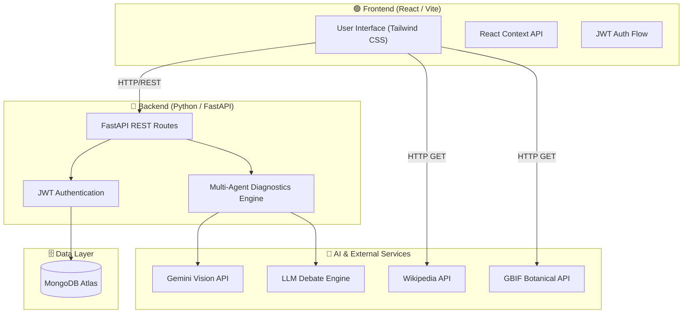

<div align="center">


**The Intelligent Botanical Diagnostic & Encyclopedia System**

A self-hosted, multi-agent AI travel planner for your plants — featuring image diagnostics, conversational AI, and the world's largest open botanical database.

<br />

<a href="https://github.com/yuvanvishnupandi/phytonexus"></a>
&nbsp;
<a href="https://github.com/yuvanvishnupandi/phytonexus"></a>
&nbsp;
<a href="LICENSE"></a>

</div>

---

<div align="center">

<!-- Screenshot Banner -->


</div>

<br />

<div align="center">
  <!-- Screenshots -->
  <a href="#"></a>
  <a href="#"></a>
  <a href="#"></a>
  <a href="#"></a>
</div>

---

## System Architecture



---

## What you get

<details open>
<summary><b>See all features</b></summary>

<table>
<tr>
<td width="50%" valign="top">

#### 🤖 Multi-Agent AI Diagnostics

- **Vision Analysis** — Upload any plant photo for instant, high-accuracy disease and health diagnosis.
- **Agentic Debate Engine** — Multiple LLM agents debate the symptoms in real-time on your screen to reach an absolute consensus.
- **Treatment Synthesis** — Generates a beautifully formatted, actionable recovery plan for your specific plant.
- **Real-Time Terminal** — Watch the AI agents think, process, and debate live.

</td>
<td width="50%" valign="top">

#### 🌿 Botanical Encyclopedia

- **Global Database** — Access millions of records securely hooked into GBIF and Wikipedia.
- **Robust Searching** — Search by common name (e.g. "Oak Tree") or scientific name.
- **Rich Media** — Instantly pulls massive high-res image galleries.
- **Taxonomy** — View exact Kingdom, Phylum, Order, Family, Genus, and Species metadata.

</td>
</tr>
<tr>
<td width="50%" valign="top">

#### 💬 FloraAI Chatbot

- **Context-Aware** — A dedicated chatbot that remembers your diagnostic history and provides tailored advice.
- **Streaming Responses** — Instant, token-by-token streaming for a snappy, native feel.
- **Markdown & Code** — Fully supports rendering tables, lists, and formatted treatment regimens.

</td>
<td width="50%" valign="top">

#### 🔐 Secure & Modern Platform

- **JWT Authentication** — Fast, secure login and registration system.
- **Responsive PWA Design** — Looks stunning on Desktop, Tablet, and Mobile with zero scrollbar cutoffs.
- **Beautiful UI** — Designed with a premium, organic color palette, smooth gradients, and micro-animations.

</td>
</tr>
</table>

</details>

<br />

## Tech stack

<div align="center">


</div>

Frontend built on Vite + React. Styling via TailwindCSS. State management with React Context. Backend powered by Python/FastAPI with MongoDB (Motor). AI capabilities orchestrated using Google's Gemini and advanced LLM debate pipelines. Botanical data aggregated from GBIF and Wikipedia APIs.

<br />

## Get started

### 1. Clone the repository
```bash
git clone https://github.com/yuvanvishnupandi/phytonexus.git
cd phytonexus
```

### 2. Setup the Backend
```bash
cd backend
pip install -r requirements.txt
```
Create a `.env` file in the `backend` directory:
```env
MONGODB_URI=your_mongodb_connection_string
GEMINI_API_KEY=your_gemini_api_key
CORS_ORIGINS=http://localhost:5173
```
Start the backend server:
```bash
uvicorn app.main:app --reload
```

### 3. Setup the Frontend
```bash
cd ../frontend
npm install
```
Create a `.env` file in the `frontend` directory:
```env
VITE_API_BASE_URL=http://localhost:8000
```
Start the frontend development server:
```bash
npm run dev
```

Open `http://localhost:5173` to explore PhytoNexus.

<br />

## Deployment

### Frontend (Vercel)
1. Push your code to GitHub.
2. Go to [Vercel](https://vercel.com) and import the repository.
3. Set the Framework Preset to `Vite`.
4. Set the Root Directory to `frontend`.
5. Add the `VITE_API_URL` environment variable pointing to your deployed backend.
6. Deploy!

### Backend (Render / Heroku)
1. Create a new Web Service on [Render](https://render.com).
2. Connect your GitHub repository.
3. Set the Root Directory to `backend`.
4. Build Command: `pip install -r requirements.txt`
5. Start Command: `uvicorn app.main:app --host 0.0.0.0 --port 10000`
6. Add the environment variables (`MONGODB_URI`, `CORS_ORIGINS`, `GEMINI_API_KEY`).
7. Deploy!

---

## License

PhytoNexus is licensed under the MIT License.
