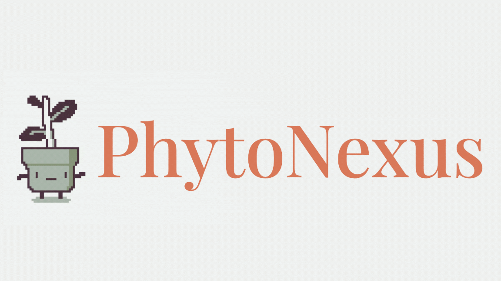
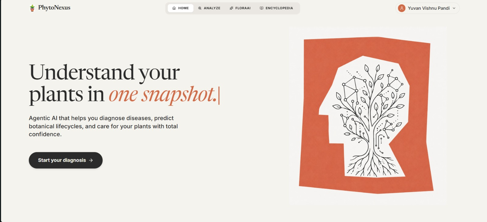
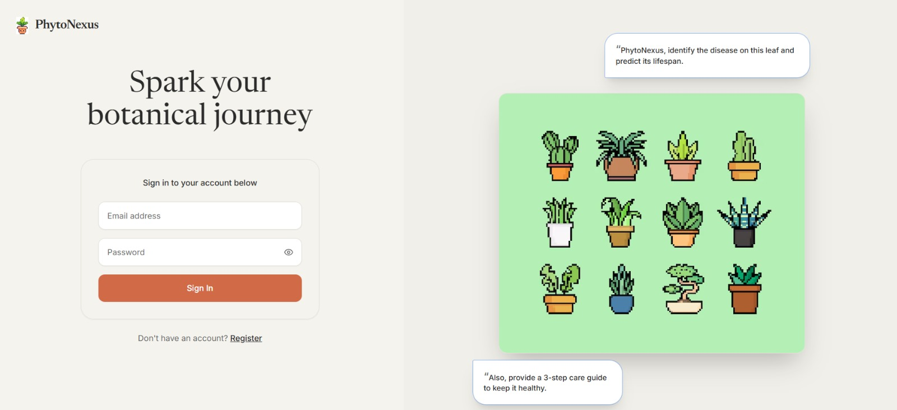
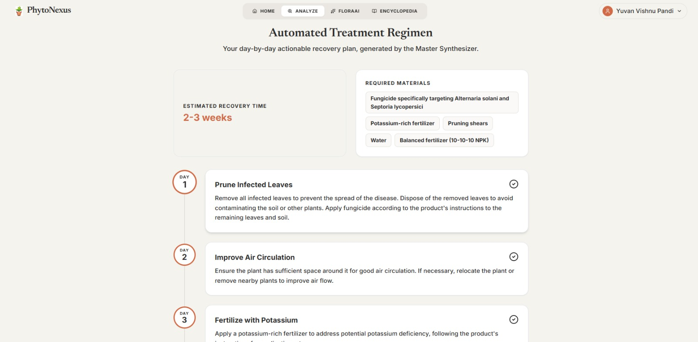
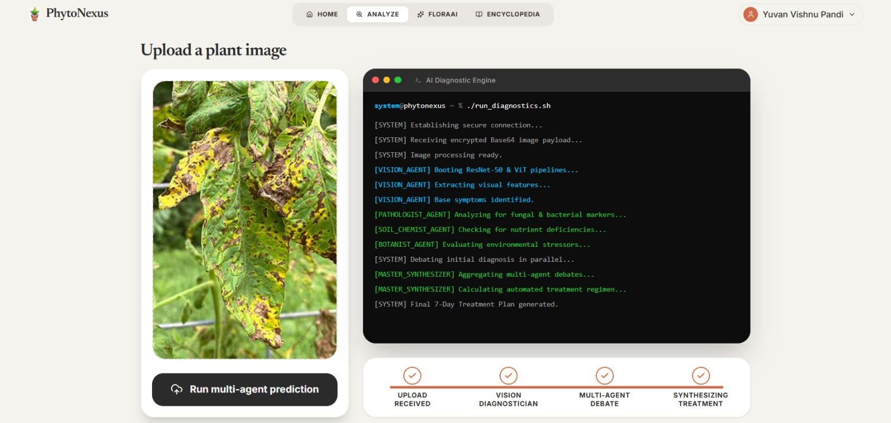
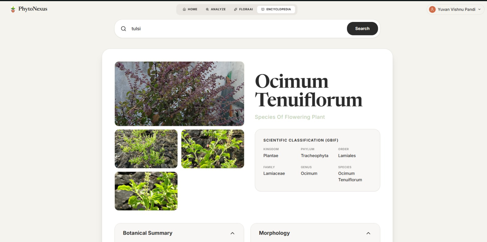
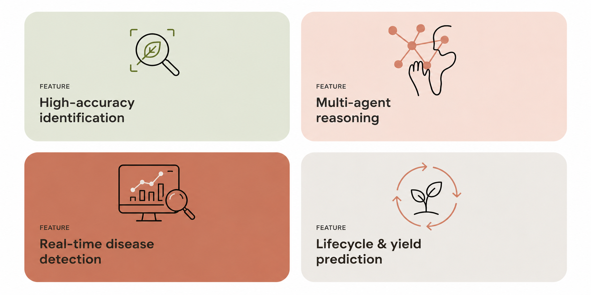
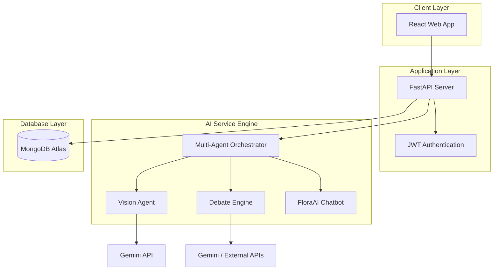
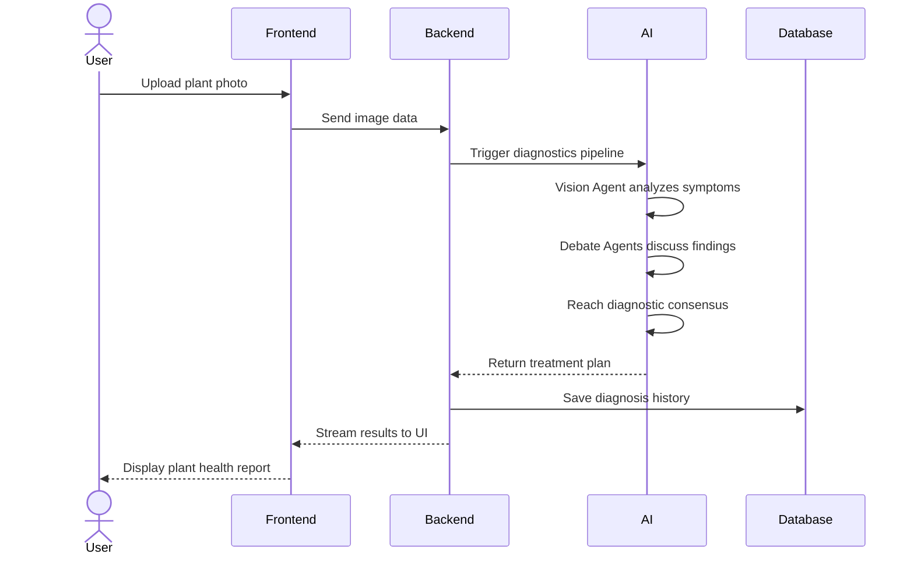

<div align="center">
  
</div>

<br />

<div align="center">
<p>The Intelligent Botanical Diagnostic & Encyclopedia System — featuring image diagnostics, conversational AI, and the world's largest open botanical database.</p>
<br />

<a href="LICENSE"></a>
&nbsp;
<a href="https://github.com/yuvanvishnupandi/phytonexus/stargazers"></a>
&nbsp;
<a href="https://github.com/yuvanvishnupandi/phytonexus/commits/main"></a>

</div>

---

<div align="center">

<table>
  <tr>
    <td></td>
    <td></td>
  </tr>
  <tr>
    <td></td>
    <td></td>
  </tr>
  <tr>
    <td></td>
    <td></td>
  </tr>
</table>

</div>

---

## What you get

<div align="center">

</div>

<details>
<summary><b>See all features</b></summary>

<table>
<tr>
<td width="50%" valign="top">

#### 🤖 Multi-Agent AI Diagnostics

- **Vision Analysis** — Upload any plant photo for instant, high-accuracy disease and health diagnosis.
- **Agentic Debate Engine** — Multiple LLM agents debate the symptoms in real-time on your screen to reach an absolute consensus.
- **Treatment Synthesis** — Generates an actionable recovery plan for your specific plant.
- **Real-Time Terminal** — Watch the AI agents think, process, and debate live.

</td>
<td width="50%" valign="top">

#### 🌿 Botanical Encyclopedia

- **Global Database** — Access millions of records securely hooked into GBIF and Wikipedia.
- **Robust Searching** — Search by common name or scientific name.
- **Rich Media** — Instantly pulls massive high-res image galleries.
- **Taxonomy** — View exact Kingdom, Phylum, Order, Family, Genus, and Species metadata.

</td>
</tr>
<tr>
<td width="50%" valign="top">

#### 💬 FloraAI Chatbot

- **Context-Aware** — A dedicated chatbot that remembers your diagnostic history and provides tailored advice.
- **Streaming Responses** — Instant, token-by-token streaming for a snappy, native feel.
- **Markdown & Code** — Fully supports rendering tables, lists, and formatted treatment regimens.

</td>
<td width="50%" valign="top">

#### 🔐 Secure & Modern Platform

- **JWT Authentication** — Fast, secure login and registration system.
- **Responsive PWA Design** — Looks stunning on Desktop, Tablet, and Mobile with zero scrollbar cutoffs.
- **Beautiful UI** — Designed with a premium, organic color palette, smooth gradients, and micro-animations.

</td>
</tr>
</table>

</details>

<br />

## Get started

```bash
git clone https://github.com/yuvanvishnupandi/phytonexus.git
cd phytonexus
```

Configure your MongoDB database and environment variables, then start the FastAPI backend and Vite frontend (see [Local Setup](#local-setup) below).

<br />

## Tech stack

<div align="center">


</div>

Frontend built on Vite + React. Styling via TailwindCSS. State management with React Context. Backend powered by Python/FastAPI with MongoDB (Motor). AI capabilities orchestrated using Google's Gemini and advanced LLM debate pipelines. Botanical data aggregated from GBIF and Wikipedia APIs.

<br />

<h2 id="architecture">🏛️ Overall system architecture</h2>

The application follows a modern decoupled architecture consisting of the React presentation layer, FastAPI backend, LLM services, and MongoDB database. Each component operates independently and communicates through REST APIs.



<br />

## 🔄 Diagnostic processing workflow

The following sequence diagram illustrates how a plant image is processed from submission to full diagnosis.



<br />

## 🔄 Core data flow

1. User uploads a plant image or searches the encyclopedia.
2. The React frontend forwards the request to the FastAPI backend.
3. The Vision Agent extracts visual symptoms and health indicators.
4. The Debate Engine cross-references findings and agrees on the disease.
5. The processed diagnosis is stored in MongoDB.
6. The user receives a comprehensive, formatted treatment plan.

<br />

<h2 id="multi-agent-ai-engine">🧠 Multi-agent AI engine</h2>

The AI service is designed as a collection of specialized agents. Each agent performs a dedicated task, allowing the system to process reports in a structured manner.

<details>
<summary><b>See all agents</b></summary>

<br />

- **Vision Agent**
  - Extracts symptoms and plant species directly from uploaded photos.

- **Debate Engine**
  - Multiple LLMs converse to eliminate false positives and finalize a diagnosis.

- **Treatment Synthesizer**
  - Converts the debated consensus into a clear, step-by-step recovery guide.

- **FloraAI Assistant**
  - Answers user queries regarding plant care and historical diagnostics.

</details>

<br />

<h2 id="local-setup">🚀 Local setup</h2>

### Prerequisites

- Node.js 18 or later
- Python 3.9 or later
- MongoDB Atlas account

### Clone repository

```bash
git clone https://github.com/yuvanvishnupandi/phytonexus.git
cd phytonexus
```

<details>
<summary><b>Backend setup</b></summary>

```bash
cd backend
pip install -r requirements.txt
uvicorn app.main:app --reload
```

</details>

<details>
<summary><b>Frontend setup</b></summary>

```bash
cd frontend
npm install
npm run dev
```

</details>

<br />

<h2 id="environment-variables">Environment variables</h2>
<details>
<summary><b>Full reference</b></summary>

<br />

> Template based on the services in use — confirm exact variable names against your `.env.example` files before deploying.

| Variable | Description | Where |
|----------|-------------|-------|
| `MONGODB_URI` | MongoDB connection string | `backend/.env` |
| `GEMINI_API_KEY` | Google Gemini API key for the Vision Agent | `backend/.env` |
| `CORS_ORIGINS` | Allowed frontend origins (e.g. `http://localhost:5173`) | `backend/.env` |
| `VITE_API_BASE_URL` | Base URL the frontend uses to call the backend API | `frontend/.env` |

</details>

<br />

## Data & storage

- **Database** — MongoDB Atlas
- **Uploads** — Plant images processed securely
- **Hosting** — frontend on Vercel, backend on Render

<br />

## License

PhytoNexus is [MIT licensed](LICENSE).
